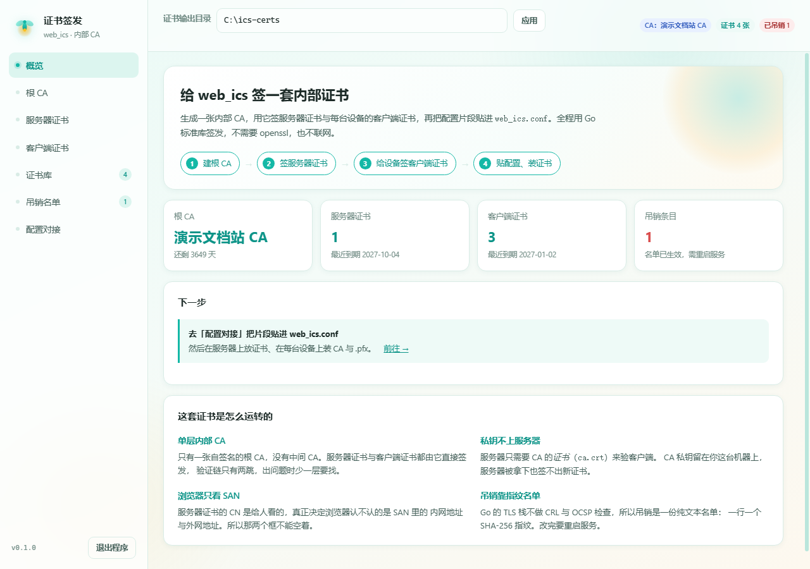
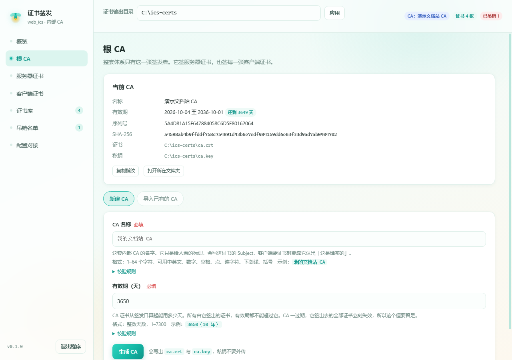
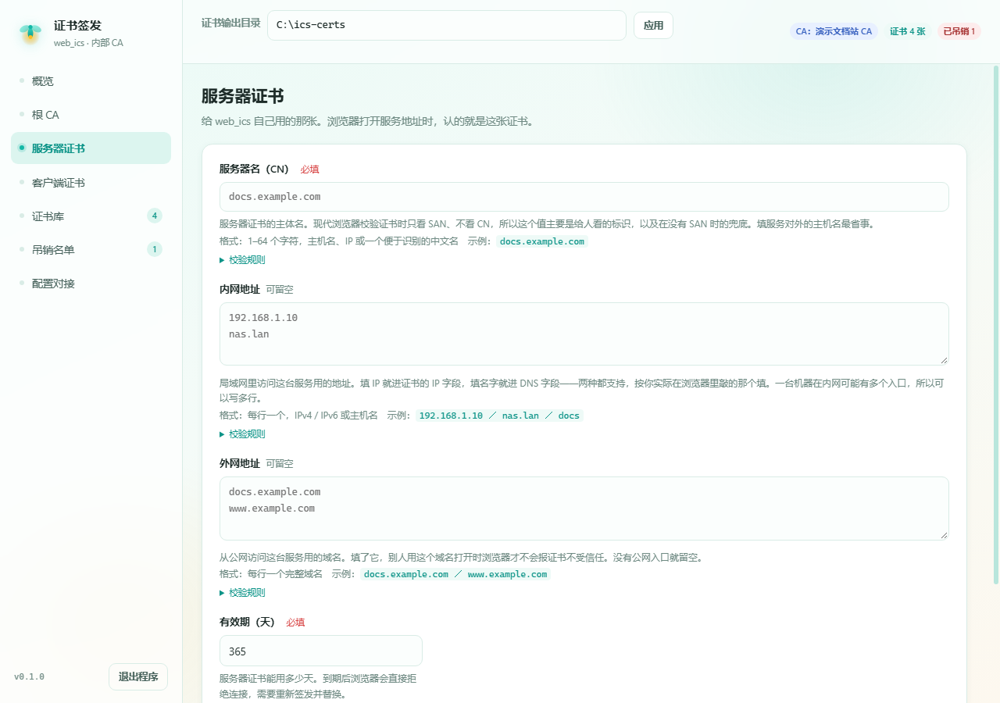
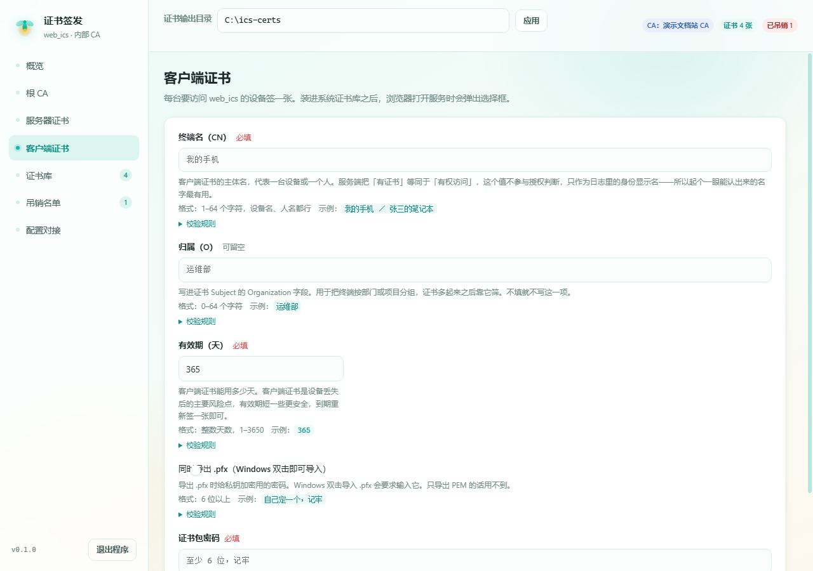
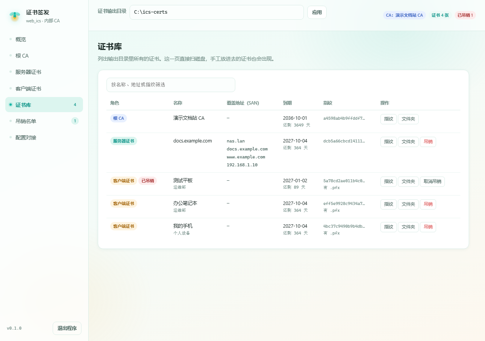
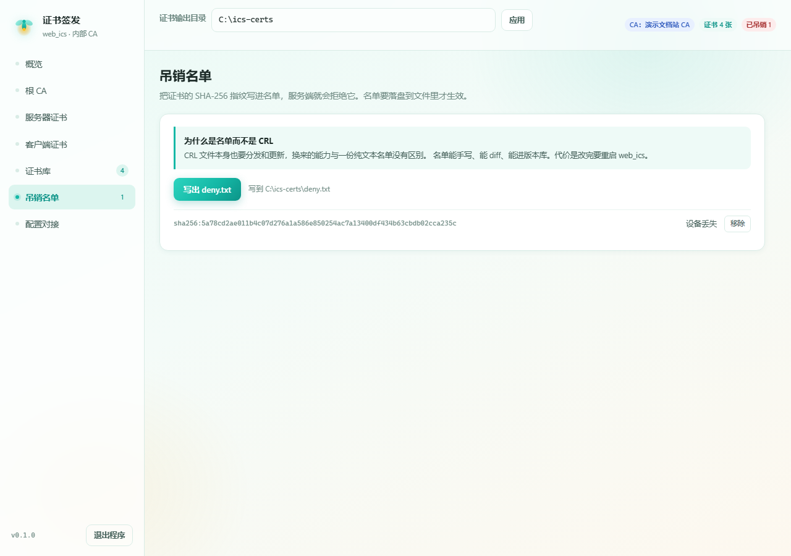
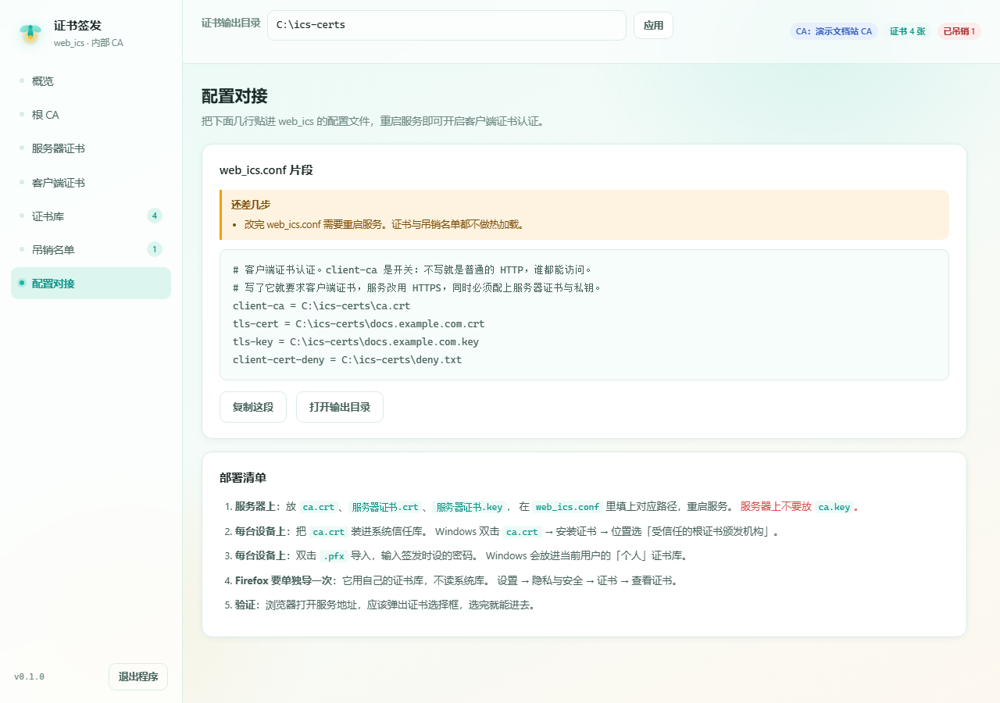

# web-ics-ca

web-ics-ca 是 [Web_ICS](https://github.com/loveFirefly-26710/Web_ICS) 的证书签发器。带图形界面，
签发全部走 Go 标准库的 `crypto/x509`，不需要 openssl，也不联网。

web_ics 支持客户端证书认证，但开启它需要在服务器上手工执行一串 openssl 命令。这个工具把那串
命令做成了界面：建内部 CA、签服务器证书、给每台设备签客户端证书、导出浏览器能直接双击安装的
`.pfx`、维护吊销名单、生成配置片段。

```
┌──────────────┐   签   ┌──────────────────┐   部署到服务器  ┌────────────┐
│  根 CA        │──────▶│ 服务器证书         │──────────────▶│  web_ics   │
│  ca.crt/key  │       │ SAN=内网+外网地址  │               │  HTTPS+mTLS│
│              │       └──────────────────┘               └────────────┘
│  私钥只留在   │                                              ▲
│  签发这台机器 │   签   ┌──────────────────┐  装进设备证书库   │
│              │──────▶│ 客户端证书（每台一张）│────────────────┘
└──────────────┘       │ CN=终端名          │
                       └──────────────────┘
```

---

## 目录

- [前置要求](#前置要求)
- [快速开始](#快速开始)
- [界面导览](#界面导览)
- [签发流程](#签发流程)
- [文件放在哪里](#文件放在哪里)
- [安装证书](#安装证书)
- [卸载证书](#卸载证书)
- [吊销一张证书](#吊销一张证书)
- [把文件传到服务器](#把文件传到服务器)
- [配置对接](#配置对接)
- [配置字段与校验规则](#配置字段与校验规则)
- [Docker](#docker)
- [界面滚动](#界面滚动)
- [界面清晰度与 DPI 缩放](#界面清晰度与-dpi-缩放)
- [常见问题](#常见问题)
- [注意事项](#注意事项)
- [构建](#构建)
- [实现说明](#实现说明)
- [目录结构](#目录结构)
- [许可证](#许可证)

---

## 前置要求

**运行环境（签发这台机器）**

| 要求 | 说明 |
|---|---|
| Windows 10 1703 或更新 | 更早的系统会退回 `SetProcessDPIAware`，在非 100% 缩放的屏幕上会糊 |
| WebView2 运行时 | Win11 自带；Win10 装过新版 Edge 的也有。缺了不会白屏，会自动退回系统浏览器并把原因弹出来 |
| 磁盘空间 | 几十 MB（WebView2 的用户数据目录），证书本身很小 |

不需要装 Go，不需要装 openssl，不需要联网。

**部署目标（跑 web_ics 的服务器）**

- 一份能正常运行的 web_ics
- 能改 `web_ics.conf` 并重启服务
- 建议把证书目录与文档库分开——证书目录里有私钥

**客户端设备**

- Windows：双击导入 `.crt` 与 `.pfx` 即可，用系统自带的证书管理器
- macOS：用「钥匙串访问」导入
- 用 Firefox 的话要单独再导一次，它不读系统证书库

---

## 快速开始

双击 `dist/web-ics-ca.exe` 就行。它在本机回环地址上起一个服务（端口由系统挑，不占用固定端口），
然后用内嵌的 WebView2 开一个属于自己的窗口把界面显示出来：没有地址栏，没有 Edge 的痕迹，
也不弹控制台。



> 截图中的文件路径统一替换成了占位符 `C:\ics-certs`，避免带出机器上的真实目录。

**关掉窗口就等于退出程序**。右上角的 ✕ 和界面左下角的「退出程序」都一样，进程和 WebView2
的子进程会一起退干净。

**同时只允许开一个窗口。** 再双击一次不会开出第二个，而是把已经开着的那个叫到前面来。
这不是偷懒：两个实例会共用同一个 WebView2 用户数据目录，先启动的那个一退出会把共用的浏览器
进程一起带走，后启动的窗口立刻变成一片黑。

命令行参数：

| 参数 | 作用 |
|---|---|
| `--out-dir <路径>` | 指定证书输出目录并记住它，下次启动直接用 |
| `--browser` | 不用内嵌窗口，改用系统浏览器打开界面 |
| `--no-open` | 只起服务、打印地址，不打开任何界面（给脚本用） |
| `--version` | 打印版本号 |

第一次用建议显式给一次输出目录，省得每次都在界面上填：

```
web-ics-ca.exe --out-dir ./ics-certs
```

---

## 界面导览

左边七个页签，按顺序走一遍就是完整流程。概览页会跟着进度把「下一步该做什么」顶到最上面。

| 页签 | 做什么 |
|---|---|
| **概览** | 四张统计卡 + 下一步提示。证书快到期或已过期时在这里提醒 |
| **根 CA** | 新建或导入 CA。当前 CA 的名称、有效期、序列号、指纹、文件路径都在这页 |
| **服务器证书** | 签 web_ics 自己用的那张证书 |
| **客户端证书** | 给设备签证书，可以顺带导出 `.pfx` |
| **证书库** | 输出目录里的全部证书。直接扫磁盘，手工放进去的也会出现 |
| **吊销名单** | 当前名单，以及「写出 deny.txt」 |
| **配置对接** | `web_ics.conf` 片段 + 部署清单 |

### 根 CA



「新建 CA」填一个名字和有效期，点生成，得到 `ca.crt` 与 `ca.key`。已经有 openssl 建好的 CA
就用旁边的「导入已有的 CA」把它收进来。

导入只做复制，不改内容。CA 证书一旦被重新编码，指纹就变了，客户端已经装好的那一份会对不上。

### 服务器证书



三个地址类字段要分清：

- **服务器名（CN）**：证书主体名，给人看的标识。浏览器校验证书时不看它。
- **内网地址**：局域网里访问这台服务用的地址，可以是 IP（`192.168.1.10`）也可以是内网主机名
  （`nas.lan`、`docs`）。每行一个。
- **外网地址**：公网访问用的域名，比如 `docs.example.com`。每行一个，没有公网入口就留空。

内网和外网地址合起来进证书的 SAN，那才是浏览器真正校验的东西。填 IP 的进 IP 字段，填名字的进
DNS 字段，工具自己判断。

### 客户端证书



终端名建议起成一眼能认出来的（`我的手机`、`张三的笔记本`）。服务端日志里显示的就是它，
吊销的时候也是靠这个名字定位。

勾上「同时导出 .pfx」并设一个密码，Windows 上双击这个文件就能把证书装进个人证书库。

### 证书库



列出输出目录里所有证书，显示角色、覆盖的地址、到期时间、指纹。可以按名称、地址或指纹筛选。
每行有「指纹」（复制 SHA-256）、「文件夹」（打开所在目录）和「吊销」。

### 吊销名单



名单存在程序自己的状态文件里，点「写出 deny.txt」才落到输出目录。

### 配置对接



实时生成 `web_ics.conf` 的片段。缺什么会列在上面。

---

## 签发流程

### 第一步：建根 CA

「根 CA」页签 → 新建 CA。填一个名字和有效期，点生成。

有效期建议不小于 3650 天。换 CA 比换服务器证书麻烦得多：每台设备都要重装信任库。

### 第二步：签服务器证书

「服务器证书」页签。把浏览器实际访问用的地址填进内网、外网两栏。

有效期默认 365 天。到期后浏览器会直接拒绝连接，需要重新签发并替换。

### 第三步：给设备签客户端证书

「客户端证书」页签。每台设备签一张。

同一个人的多台设备建议在终端名上带后缀区分（`张三-手机`、`张三-笔记本`），吊销时才好定位。

### 第四步：贴配置、装证书

「配置对接」页签里复制片段，贴进 `web_ics.conf`，重启服务。然后按下面的步骤给服务器和设备
放文件、装证书。

---

## 文件放在哪里

一次完整的签发会在输出目录里留下这些文件：

| 文件 | 放哪 | 说明 |
|---|---|---|
| `ca.crt` | 服务器 + 每台设备 | CA 证书。服务器用它验客户端，设备把它装进信任库 |
| `ca.key` | **只留在签发机** | CA 私钥。它要是上了服务器，服务器被拿下就等于 CA 被拿下 |
| `<服务器名>.crt` / `.key` | 服务器 | 服务器证书与私钥，配到 `tls-cert` / `tls-key` |
| `<终端名>.crt` / `.key` | 归档 | 客户端证书的 PEM 形态，`curl --cert` 这种命令行场景用得上 |
| `<终端名>.pfx` | 设备 | 带私钥的证书包，双击导入。密码是签发时设的那个 |
| `deny.txt` | 服务器 | 吊销名单，配到 `client-cert-deny` |

**服务器上放什么**：`ca.crt`、服务器证书与私钥、`deny.txt`。放在一个专门的目录里，
建议和文档库分开——这里面有私钥。

**服务器上不放什么**：`ca.key`、客户端证书的私钥、`.pfx`。

**每台设备上放什么**：`ca.crt`（装进信任库）与该设备自己的 `.pfx`（装进个人证书库）。

重名不会覆盖。第二次签同一个名字会得到 `<名字>-2.crt`。覆盖的后果很隐蔽：私钥被换掉、
旧证书还在某台设备上装着，两边指纹对不上，排查时没有任何线索指向签发环节。

---

## 安装证书

### Windows

**装 CA（每台设备都要做一次）**

1. 双击 `ca.crt`
2. 点「安装证书」
3. 存储位置选「本地计算机」或「当前用户」都行。选「本地计算机」需要管理员权限，
   好处是所有用户都能用
4. 下一步 → 「将所有的证书都放入下列存储」→ 浏览 → 选**「受信任的根证书颁发机构」**
5. 完成。会弹一个安全警告，点「是」

⚠️ 这一步别选成「个人」。装到「个人」里的话，浏览器不认这个 CA，服务器证书照样不受信任。

**装客户端证书**

1. 双击 `<终端名>.pfx`
2. 存储位置选「当前用户」（选「本地计算机」的话，非管理员进程可能读不到私钥）
3. 输入签发时设的密码
4. 下一步 → 让系统自动选择证书存储
5. 完成

**用命令行装（可选）**

```
certutil -user -csp KSP -p <pfx 密码> -importPFX My "<pfx 完整路径>" NoRoot,NoProtect
```

`-csp KSP` 不能省，原因见「常见问题」里关于加密提供程序的那条。

**验证装好了**

```
certutil -user -store My
```

应该能看到那张客户端证书。看「提供程序」一栏应当是
`Microsoft Software Key Storage Provider`。

### macOS

1. 双击 `ca.crt`，钥匙串访问会打开。把它加到**「系统」**钥匙串
2. 双击刚加进去的证书，展开「信任」，把「使用此证书时」改成**「始终信任」**
3. 双击 `.pfx`，加到「登录」钥匙串

Chrome 与 Safari 用系统钥匙串，装完就能用。Firefox 要单独导。

### Firefox（单独导一次）

Firefox 用自己的证书库，不读系统库。

1. 设置 → 隐私与安全 → 证书 → 查看证书
2. 「证书颁发机构」页 → 导入 → 选 `ca.crt` → 勾上「信任由此证书颁发机构来标识网站」
3. 「您的证书」页 → 导入 → 选 `.pfx` → 输入密码

### 验证

浏览器打开服务地址，应该弹出证书选择框，选完就能进去。

没弹选择框，或者弹了但进不去，看[常见问题](#常见问题)。

---

## 卸载证书

### Windows

**图形界面**：`certmgr.msc`（当前用户）或 `certlm.msc`（本地计算机）→ 找到对应的证书 →
右键删除。

**命令行**：先查指纹，再删。

```
:: 查当前用户个人库里的证书
certutil -user -store My

:: 按 SHA-1 指纹删除
certutil -user -delstore My <SHA-1 指纹>

:: 删受信任的根证书颁发机构里的 CA
certutil -user -delstore Root <CA 的 SHA-1 指纹>
```

⚠️ **同一张证书可能在「当前用户」和「本地计算机」两个库里各有一份。** 只删一个的话，
浏览器可能挑到剩下那张，症状是「明明删了还在用」。两个库都查一遍。

### macOS

钥匙串访问 → 找到证书 → 右键删除。CA 在「系统」钥匙串里，客户端证书在「登录」钥匙串里。

### Firefox

设置 → 隐私与安全 → 证书 → 查看证书 → 在对应的页签里选中证书 → 删除。

### 什么时候需要卸载

- 设备换人了，旧的客户端证书要作废
- 证书装到了错误的存储位置（比如 CA 装进了「个人」）
- 私钥的加密提供程序不对，需要删掉重导

**卸载不等于吊销。** 卸载只是这台设备不再带证书；证书本身在服务端仍然有效，别人拿到
那份 `.pfx` 加密码照样能用。要真正作废得走[吊销](#吊销一张证书)。

---

## 吊销一张证书

1. 「证书库」页签找到那一行，点「吊销」，填一个备注（可选）
2. 切到「吊销名单」页签，点「写出 deny.txt」
3. 把新的 `deny.txt` 传到服务器
4. 重启 web_ics

名单是纯文本，一行一个 SHA-256 指纹，`#` 开头是注释：

```
# web_ics 客户端证书吊销名单
# 一行一个 sha256 指纹，后面可以跟备注。改完需要重启服务生效。
sha256:2f8a...e41 我的手机
```

指纹由工具生成，不要手写。格式与 web_ics 的 `auth.go` 解析口径完全一致——两边对不上时
服务端会把整个名单判成格式错误然后拒绝启动。

写错了想撤回来：在「吊销名单」页签点「移除」，或者在证书库那一行点「取消吊销」，
然后重新写出 `deny.txt`。

---

## 把文件传到服务器

**用 scp**（Windows 10 以上自带 OpenSSH 客户端）：

```
scp ca.crt docs.example.com.crt docs.example.com.key deny.txt user@server:/etc/web_ics/certs/
```

**用 sftp / WinSCP / FileZilla**：图形化传文件，适合不熟悉命令行的场景。

**用共享目录**：如果服务器和签发机在同一个局域网，映射一个共享目录直接拖过去也行。

**传完记得两件事**：

1. 在服务器上改 `web_ics.conf`，把 `client-ca` / `tls-cert` / `tls-key` /
   `client-cert-deny` 指到新路径
2. 重启 web_ics

**别传 `ca.key`。** 服务器只需要 `ca.crt` 来验客户端，不需要签发能力。

**权限**：证书目录建议 `700`，私钥文件 `600`。目录里如果有别人能读的文件，私钥就等于泄露。

```
chmod 700 /etc/web_ics/certs
chmod 600 /etc/web_ics/certs/*.key
```

---

## 配置对接

工具生成的片段长这样：

```ini
# 客户端证书认证。client-ca 是开关：不写就是普通的 HTTP，谁都能访问。
# 写了它就要求客户端证书，服务改用 HTTPS，同时必须配上服务器证书与私钥。
client-ca = ./ics-certs/ca.crt
tls-cert = ./ics-certs/docs.example.com.crt
tls-key = ./ics-certs/docs.example.com.key
client-cert-deny = ./ics-certs/deny.txt
```

`client-ca` 是 web_ics 那侧唯一的开关。配了它却没配 `tls-cert`/`tls-key` 时服务会直接拒绝
启动，不会退化成「以为开了其实没开」。所以这四行是一组，不要只贴一行。

改完配置要重启 web_ics。证书与吊销名单都是启动时读一次，不做热加载。

---

## 配置字段与校验规则

每个字段的用途、格式、示例、校验规则在界面上都有，跟着输入框显示，随输入实时校验。
完整的一张表在 [docs/字段说明与校验规则.md](docs/字段说明与校验规则.md)。

界面上那份说明和实际校验逻辑是同一份代码生成的（`internal/validate` 的 `Catalog()`），
不存在「文档写一套、程序判一套」的可能。

几条容易踩的规则先说在这里：

| 规则 | 为什么 |
|---|---|
| 内网地址与外网地址至少要填一个 | 服务器证书没有 SAN 时，现代浏览器一律不认，而 openssl 默认不写 SAN |
| 外网地址必须是至少两段的完整域名 | `intranet` 这种单段名在公网解析不了，证书里写了也没用。内网地址允许单段 |
| 地址里不能带协议前缀、端口、路径 | 这些是 URL 的组成部分，不是主机名。写了会让证书里的 SAN 变成无效值 |
| 子证书的有效期不能超过 CA 的剩余有效期 | 那段时间里证书看着完好，浏览器却一律拒绝，因为签发者已经失效了 |
| 客户端证书必须有 `clientAuth` 与 `digitalSignature` | 缺 `digitalSignature` 时 Windows 的证书选择器可能不认这张证书，浏览器根本不把它递出去 |

---

## Docker

先说结论：**这个工具是给 Windows 桌面用的，Docker 不是它的主要部署方式。** 它靠内嵌
WebView2 显示界面，服务只监听回环地址、端口随机，这些设计都是为了「本机单窗口」这个场景。

Docker 能派上用场的是另外两件事。

### 一、用容器交叉编译出 Windows EXE

在没有 Windows 机器的环境里（CI、Linux 开发机）产出 `web-ics-ca.exe`：

（内容见仓库根目录的 `Dockerfile.build`）

```
docker build -f Dockerfile.build -t web-ics-ca-build .
docker run --rm -v "%cd%\dist:/dist" web-ics-ca-build
```

产物出现在宿主机的 `dist\web-ics-ca.exe`。

### 二、在 Linux 宿主机上，用容器跑服务并把界面开在宿主机的浏览器里

这条路能走通，但**必须用 `--network host`**：服务只监听容器内的 `127.0.0.1`，
普通端口映射到不了它。用了 host 网络之后，容器里的回环就是宿主机的回环。

（内容见仓库根目录的 `Dockerfile`）

```
docker build -t web-ics-ca .
docker run --rm --network host -v "$PWD/ics-certs:/certs" web-ics-ca --out-dir /certs
```

容器启动后会把带令牌的地址打印到日志里：

```
docker logs <容器名>
```

复制那行地址，在宿主机的浏览器里打开。生成的证书落在挂载出来的 `ics-certs/` 目录里。

**限制，用之前要知道**：

- 只支持 Linux 宿主机。macOS 与 Windows 上的 Docker Desktop 没有 host 网络这个模式，
  这条路走不通
- 容器跑起来之后界面靠日志里的地址访问，比双击 EXE 麻烦
- `--network host` 意味着容器不再是网络隔离的。虽然服务只监听回环，但这是要知情的选择
- 容器里没有图形界面，`--browser` 与内嵌窗口都用不了，只能 `--no-open`

如果只是自己在一台 Windows 机器上签发证书，直接用 EXE 更省事。

---

## 界面滚动

界面分成三块：左侧导航栏、顶部一条输出目录栏、右侧主内容区。需要经常滚的只有主内容区。

| | |
|---|---|
| **位置** | 主内容区右边缘。侧栏右边缘用的是同一套样式 |
| **样式** | 滑块是薄荷色圆角胶囊：常态 `#b9e6dc`，悬停 `#14b8a6`，按住 `#0d9488`。轨道透明，两端没有箭头按钮，右下角不画小方块。滑块比轨道窄 4px（2px 透明边框配 `background-clip`），看着轻一些 |
| **宽度** | CSS 里写 10px。实测在 `devicePixelRatio` 1.25 的屏上是 9px，浏览器按设备像素取整，不是样式没生效 |
| **显示条件** | `overflow-y: auto`：内容高于可视区才出现，不超出时完全隐藏、不占宽度。主内容区另外开了 `scrollbar-gutter: stable`，常驻一条 10px 的沟槽，所以在长短不一的页面之间切换时，滚动条的出现与消失不会让内容左右跳 |
| **交互行为** | 滚轮上下滚；拖动滑块（拖动过程中实时跟随，不是松手才跳）；点轨道空白处翻一页；滑块悬停变深、按住更深。键盘 `PageUp` / `PageDown` / `Home` / `End` / 方向键可用 |
| **适用范围** | 只有主内容区和侧栏用了这套样式。`textarea`、配置片段的代码块各自独立滚动，保留浏览器默认滚动条，全都染成同一个颜色反而会让人以为整页在滚 |
| **不做横向滚动** | 实测窗口宽 820–1400px、七个页面全部没有横向溢出。证书库里的长路径靠 `word-break` 换行，指纹只显示前 16 位 |
| **侧栏何时滚** | 窗口被压得很矮、装不下七项导航时才滚。843px 高的窗口下不滚 |
| **Firefox** | 不认 `::-webkit-scrollbar`，会退回它自己的细滚动条。功能不受影响，只是没有薄荷色 |

### 键盘滚动为什么要先有焦点

浏览器把 `PageDown` 这类按键发给**焦点所在元素的最近可滚祖先**。焦点停在 `body` 上时，
它找不到主内容区，按键就没有作用对象，现象是「按了没反应」。焦点停在侧栏导航按钮上时更糟，
那个祖先是没有溢出的侧栏，同样没反应。

所以内容区加了 `tabindex="-1"`（可聚焦，但不占 Tab 顺序，免得从侧栏按一堆 Tab 才能到表单），
并在每次切页时把焦点交给它。实测三种入口都能滚：打开就按、点侧栏导航之后按、点内容区之后按。
输入框里按方向键仍然归输入框，不会被抢走。

---

## 界面清晰度与 DPI 缩放

在 125% 缩放的机器上，窗口一打开整个画面（文字、图标、边框）都发虚，像隔了一层。根因是
进程没有声明 DPI 感知，Windows 只好替它把画面做位图放大。

### 什么情况下会模糊

| 场景 | 会不会模糊 |
|---|---|
| 系统缩放 100% | 不会。拉伸比例是 1.0，等于没缩放 |
| 系统缩放 125% / 150% / 175% | **会**。Windows 按缩放比把整个窗口位图放大，文字边缘发虚 |
| 从启动到主界面 | 从第一帧就是模糊的。没有独立的启动画面，但窗口一出现就已经处在拉伸状态 |
| 各个页签 | 全都模糊。拉伸作用在整个窗口上，跟具体是哪一页无关 |
| 多显示器之间拖动 | 修复前，拖到缩放比不同的屏上会一直模糊 |

这个毛病只在非 100% 缩放的机器上暴露，在 100% 的机器上开发根本看不出来。

### 怎么定位

三步，都是客观量出来的：

1. **量窗口的物理尺寸。** 从一个 DPI 感知的进程去 `GetWindowRect`：程序请求的是 1180×820，
   量出来却是 **1475×1025**，正好 1.25 倍，说明系统在替它缩放。
2. **问进程的感知级别。** `shcore!GetProcessDpiAwareness` 返回 `0 = UNAWARE` 就是它；
   `1 = SYSTEM_AWARE`、`2 = PER_MONITOR_AWARE` 是好的。本程序修复前是 **0**，修复后是 **2**。
3. **客观量锐度。** 修复前后在同一位置各截一张窗口图，算拉普拉斯方差：实测四个文字区域
   分别提升 **2.94× / 2.73× / 2.76× / 2.41×**。同时确认布局没变，两张图的最佳对齐偏移
   只有 3px。

### 修复

进程启动时、在创建任何窗口之前声明 DPI 感知（见 `dpi_windows.go`）：

```go
// DPI_AWARENESS_CONTEXT_PER_MONITOR_AWARE_V2 = -4
procSetProcessDpiAwarenessContext.Call(perMonitorAwareV2)
```

- 优先 Per-Monitor V2（Win10 1703+）：窗口在不同缩放比的显示器之间拖动时，系统会让应用
  重新布局，而不是拉伸。系统太老就退回 `SetProcessDPIAware()`。
- **必须在建窗口之前调用。** 窗口一建出来，整个进程的 DPI 感知就定死了，之后再调会被静默
  忽略（函数返回 0，不报错）。
- 副作用要一起处理：声明感知之后，代码里写的 1180 就真的是 1180 个物理像素了，在 125% 的屏上
  会比原来小一圈。所以要乘上缩放比（`scaleForDPI`），窗口看起来的大小才和以前一致。

界面本身不用改：全是 CSS 文字、SVG 和纯色块，没有位图，声明感知之后 WebView2 会按缩放比
原生渲染。

### 没验到的部分

本机只有一块 2560×1440 的屏（缩放 125%），**多显示器之间不同缩放比拖动**这条路径没有实测过。
代码是按 Per-Monitor V2 写的，理论上系统会通知重新布局。

---

## 常见问题

**程序起不来，或者窗口里一片空白**
先看有没有弹错误框。程序编译成窗口子系统，没有控制台，启动阶段的错误只能靠弹框说出去。
窗口起不来时会自动退回系统浏览器并把原因一并弹出来，也可以用 `--browser` 强制走那条路。

**提示缺少 WebView2 运行时**
Win11 自带，Win10 装过新版 Edge 的也有。确实没有的话，程序会自动退回系统浏览器，功能不受影响。

**页面显示「需要客户端证书」**
浏览器没有可用的证书。CA 与客户端证书都装了吗？Firefox 是不是漏了单独导入？

**浏览器报 `ERR_BAD_SSL_CLIENT_AUTH_CERT`**
证书不受信、已过期，或者用途不是 `clientAuth`。这一步在 TLS 握手阶段就断了，服务端没有机会
返回说明页，具体原因看服务端日志。

**弹出了证书选择框、也能看到证书，点「确定」却没反应**
按顺序查三件事：同一张证书在「当前用户」和「本地计算机」两个个人库里各装了一份，浏览器挑到了
错的那张；服务端把连接掐了（web_ics 开启客户端认证后把 TLS 握手超时放宽到 60 秒，一般不是这个
原因）；浏览器本身的问题，实测 Edge 偶发，换 Chrome 正常。

**导入 `.pfx` 后私钥的提供程序是「Microsoft Enhanced Cryptographic Provider」**
老式加密提供程序，浏览器可能递不出证书。删掉重导：

```
certutil -user -delstore My <旧证书的 SHA-1 指纹>
certutil -user -csp KSP -p <pfx 密码> -importPFX My "<pfx 完整路径>" NoRoot,NoProtect
```

导入后 `certutil -user -store My` 里的提供程序应当是
`Microsoft Software Key Storage Provider`。

**CA 装到了「个人」里，浏览器还是不信任**
装错位置了。删掉重装，位置选「受信任的根证书颁发机构」。

**删了证书但浏览器还在用**
同一张证书可能在「当前用户」和「本地计算机」两个库里各有一份，两个都要删。

**改了证书但服务还是老样子**
web_ics 不做证书热加载，重启。

**`deny.txt` 写好了但被吊销的证书还能用**
三件事按顺序查：文件传到服务器了吗；`web_ics.conf` 里的 `client-cert-deny` 指对了吗；
服务重启了吗。另外确认名单里是完整的 64 位指纹，少一位会被服务端判成格式错误并拒绝启动。

**输出目录能建出来但签发失败**
目录不可写。工具在设置输出目录时会试写一次，当时通过的话一般是后来权限变了。
换一个目录，或者检查目录权限。

**签名证书有效期填不了太长的天数**
子证书的有效期不能超过 CA 的剩余有效期。CA 快到期了就得先换 CA。

---

## 注意事项

- **`ca.key` 不要放到服务器上。** 服务器只需要 `ca.crt`。私钥上服务器意味着服务器被拿下就等于
  CA 被拿下，可以签任意客户端证书。
- **`ca.key` 和 `.pfx` 不要进版本库。** 建议把证书输出目录加进 `.gitignore`。
- **一次完整的签发会留下私钥文件。** 输出目录建议单独建，权限收紧（目录 `700`、私钥 `600`）。
- **服务只监听 127.0.0.1。** 界面是本机工具，外面的机器连不上，这是有意的。
- **带令牌的地址不要外传。** 拿到它的人就能操作这个界面。启动时打印的那行地址里 `?t=`
  后面就是令牌。
- **同时只允许开一个实例。** 这是为了避免两个实例共用 WebView2 数据目录互相拆台，
  顺带也避免了两个窗口同时改同一个证书目录。
- **吊销后必须重启 web_ics。** 名单是启动时读一次。
- **证书过期不会自动续。** 概览页会提前提醒 30 天内到期的证书，但续期要手工做。

---

## 构建

需要 Go 1.25 或更新的版本。三种方式，产物完全一样（逐字节相同），挑一个就行。

### 方式一：`build.ps1`（Windows，推荐）

```
powershell -ExecutionPolicy Bypass -File build.ps1
```

一次做完五件事：`gofmt` 检查 → `go vet` → 编 Windows EXE → 交叉编译一份 Linux 版做跨平台
检查 → 核对产物（没有绝对路径、没有模块缓存路径）。任何一步不过就停下，不会给你一个
「看着成功其实有问题」的产物。

两个可选参数：`-Go` 指定 Go 工具链的位置（`go` 不在 PATH 里时用），`-Version` 覆盖版本号。
都不传也能跑——版本号从仓库根目录的 `VERSION` 文件里读。

### 版本号写在哪

仓库根目录的 `VERSION` 文件，现在里面是 `1.0.0`。**它是版本号的唯一来源**，改版本只改那一个
文件：构建脚本读它，CI 发版也读它。手敲下面那些 `go build` 命令时，把 `-X main.version=`
后面的值换成文件里的数字就行。

### 方式二：`build.sh`（Git Bash / Linux）

```bash
bash build.sh
```

做的是同一套事。另外它会检查 `build.ps1` 带没带 UTF-8 BOM——那个文件里有中文，缺了 BOM
在 Windows PowerShell 5.1 下会直接解析失败（原因见下面的说明）。

### 方式三：手动 `go build`

不想用脚本的话，cmd.exe 里这两条：

```
:: 主产物
go build -trimpath -ldflags="-s -w -X main.version=1.0.0 -H windowsgui" -o dist\web-ics-ca.exe .

:: 跨平台编译检查（不关心可以跳过）
set GOOS=linux
go build -trimpath -ldflags="-s -w -X main.version=1.0.0" -o dist\web-ics-ca-linux-amd64 .
set GOOS=
```

Git Bash / Linux 下对应的是：

```bash
go build -trimpath -ldflags="-s -w -X main.version=1.0.0 -H windowsgui" -o dist/web-ics-ca.exe .
GOOS=linux CGO_ENABLED=0 go build -trimpath -ldflags="-s -w -X main.version=1.0.0" -o dist/web-ics-ca-linux-amd64 .
```

### 产物

| 文件 | 是什么 |
|---|---|
| `web-ics-ca.exe` | **交付物**。单文件，拷走就能跑。唯一的运行时依赖是系统上的 WebView2 运行时。 |
| `web-ics-ca-linux-amd64` | **不是交付物**，是跨平台编译检查。项目里有 `window_other.go`、`dpi_other.go` 这些非 Windows 分支，编一份 Linux 版出来才能确认它们没被改坏。不用发。 |

### 发版

推 master 就发版，不用另外打标签。GitHub Actions 每次收到 master 推送都会构建一遍，
把 EXE 放进 Release `v<VERSION>`：

- 改了代码、版本号没动 → 已有的那个 Release 里的 EXE 换成最新的
- 改了 `VERSION` 文件里的数字 → 多出一个新的 Release

标签触发（推 `v*` 标签）和手动触发也留着，作为备用。

容器镜像会推到 GHCR。仓库令牌已有 `packages: write`；如果 GHCR 中已存在同名 package，
还要在该 package 的 **Package settings → Manage Actions access** 里把本仓库加入，并授予 Write。
这是 package 自己的访问控制，光改 workflow 的 `permissions` 不够。Dockerfile 也带了
`org.opencontainers.image.source` 标签，用来关联 GitHub 仓库。

### 几个容易踩的地方

`-H windowsgui` 不能省。它把 PE 子系统标成窗口程序（Subsystem=2）；漏掉的话拿到的是控制台
子系统（Subsystem=3），双击会先蹦出一个黑色控制台窗口，启动阶段的报错也会打进那个窗口而不是
弹框（程序靠 `GetConsoleWindow` 判断有没有控制台，有控制台就不弹）。

cmd 里 `set GOOS=` 那句别忘：`set` 设的环境变量会留在当前 cmd 窗口里，不清掉的话后面手敲的
`go build` 会莫名其妙按 linux 目标编。PowerShell 同理，`build.ps1` 里已经做了保存与还原。

`dist\` 不存在也没关系，`go build -o` 会自己建。

`build.ps1` 必须保持 UTF-8 with BOM。它里面有中文注释和中文提示语，而 Windows PowerShell 5.1
读无 BOM 文件时按系统 ANSI 代码页解码，UTF-8 汉字的末字节和 cp936 的前导字节范围重叠，会把
紧跟其后的 ASCII 引号一起吃掉，字符串不闭合，报错却是「字符串缺少终止符」并落在文件末尾。
用 PowerShell 7 测不出来（它默认按 UTF-8 读），只有 5.1 会炸。`build.sh` 里有一道守卫专门拦这个。

国内直连 `proxy.golang.org` 基本不通，两个脚本都默认把 `GOPROXY` 设成
`https://goproxy.cn,direct`。手动构建的话自己设一下这个环境变量。

### 自己跑一遍验证

项目里没有自动化测试，所以验证靠手工做这几步：

```
:: cmd.exe

:: 1. 静态检查
go vet ./...
gofmt -l .                          :: 有输出 = 那几个文件没格式化

:: 2. 构建
powershell -ExecutionPolicy Bypass -File build.ps1

:: 3. 起服务看一眼（不开窗口，只打印地址）
dist\web-ics-ca.exe --no-open
```

第 3 步会把带会话令牌的地址打印出来，复制到浏览器打开就能用。`?t=` 后面那串是令牌，别外传。
按 Ctrl+C 退出。

想要独立窗口就直接跑 `dist\web-ics-ca.exe`（双击也一样）；想用系统浏览器加 `--browser`。

---

## 实现说明

几个不那么显然的决定，写在这里省得以后有人重新纠结一遍。

**为什么是 Go，不是 Tauri / Electron。**
web_ics 本身是 Go，签发逻辑用标准库 `crypto/x509` 写就是几十行，而且能直接复用 ICS 仓库里
已经跑通的证书参数。另外交付物是一个单文件 EXE，没有运行时依赖。

**为什么界面是本地网页，不是原生控件。**
签发这件事的本质是「填一堆字段、按一下、拿到几个文件」，用网页做界面最省事，改样式不用重编译。
服务只监听回环地址，外面进不来，本机上的其他页面也被会话令牌挡在外面。

**窗口为什么是内嵌 WebView2，而不是借 Edge 的外壳。**
借 `msedge --app=` 也能得到一个没有地址栏的窗口，但任务栏和窗口上仍是 Edge 的样子，进程也不是
自己的。内嵌 WebView2 之后，这个 EXE 本身就是应用。

**内嵌 WebView2 踩到的两个坑，都值得记下来。**

一是**数据目录**。`go-webview2` 在 `DataPath` 为空时会去读 `os.Getenv("AppData")` 拼路径。
那个环境变量一旦为空（精简过的进程环境、某些服务上下文里很常见），拼出来就是相对路径
`app.exe`，而 WebView2 要求绝对路径，控制器创建于是失败并返回 `0x80080005`
（`CO_E_SERVER_EXEC_FAILURE`）。更麻烦的是这个库用 `int64(res) < 0` 判 HRESULT，而 HRESULT
是 32 位，负的错误码被零扩展成正数，判不出失败，接着拿 nil 控制器解引用直接崩，现象是一句
毫无线索的空指针 panic。现在自己给一个绝对路径（`os.UserCacheDir()` 下面），这条链就断了。

二是**进程退出**。窗口关掉、消息循环退出、`main` 一路走到 `return`，进程却一直留在任务管理器
里，WebView2 的子进程也不退；换成 `os.Exit(0)` 一样。卡点在 WebView2 运行时的进程收尾阶段
（DLL detach），而 `ExitProcess` 会逐个跑 `DllMain`。库也没有暴露「关闭 WebView2 环境」的
接口，所以最后走 `TerminateProcess`（它不跑 `DllMain`），实测 2 秒内主进程与全部子进程都退
干净。代价是跳过所有清理，这个工具没有需要清理的东西，证书和状态每次改动都已经落盘。

**为什么证书库每次扫磁盘，不存索引。**
索引与磁盘不同步是最难查的一类问题：界面说证书在，服务端说验不过。现在这个列表永远反映目录里
真实有什么，手工删掉一个文件、从别处拷进来一张证书，刷新就对得上。

**为什么主区高度要显式锁在视口内。**
`.app` 是 `height: 100vh` + `overflow: hidden` 的栅格，`.main` 是它的子项。栅格子项默认
`min-height: auto`，会拒绝收缩到内容高度以下，于是主区被内容撑高，超出视口的部分被裁掉，
而里面的 `.content` 因为容器跟着变高，永远没有溢出、永远不出现滚动条。症状是「页面底部的
内容够不着」，实测在「服务器证书」页有 294px 滚不到。修法是 `.app` 的 `grid-template-rows: 100%`
配 `.main { min-height: 0 }`。这两行看着像多余，动它们之前先想清楚。

**为什么用 RSA 2048 而不是 ECDSA。**
和 web_ics README 里那套 openssl 命令对齐。客户端证书最终要装进 Windows 证书存储，RSA 在那里
的兼容性最稳。

**与 openssl 版本的一处差异。**
Go 的标准库会把 `KeyUsage` 扩展标成 critical，openssl 的 `keyUsage=digitalSignature` 默认是
非 critical。两者浏览器都接受。服务器走的是 ECDHE 密钥交换，不需要 `keyEncipherment`，
所以 `digitalSignature` 一项就够。

---

## 目录结构

```
├─ main.go                    入口：解析参数、起服务、开窗口、等退出
├─ window_windows.go          内嵌 WebView2 的窗口，以及硬退出
├─ window_other.go            非 Windows 平台的空实现（退回浏览器）
├─ dpi_windows.go             进程级 DPI 感知与尺寸换算
├─ dpi_other.go               非 Windows 平台的空实现
├─ singleinstance_windows.go  互斥体单实例保护
├─ singleinstance_other.go    非 Windows 平台的空实现
├─ openbrowser_windows.go     退路：用 Edge 应用模式或默认浏览器打开界面
├─ openbrowser_other.go       非 Windows 平台的退路
├─ msgbox_windows.go          没有控制台时用弹框报告启动失败
├─ msgbox_other.go            非 Windows 平台：打到标准输出
├─ internal/
│  ├─ certs/                  CA、签发、解析、PKCS#12、吊销名单、目录扫描
│  ├─ validate/               字段校验规则 + 给界面用的字段说明表
│  └─ app/                    HTTP 服务、会话、证书库状态、配置片段生成
├─ ui/                        界面（构建时嵌进二进制）
├─ docs/                      开发文档、计划、字段说明、截图
├─ build.sh / build.ps1       构建脚本
└─ Dockerfile                 交叉编译用的构建镜像
```

---

## 许可证

[MIT](LICENSE)
